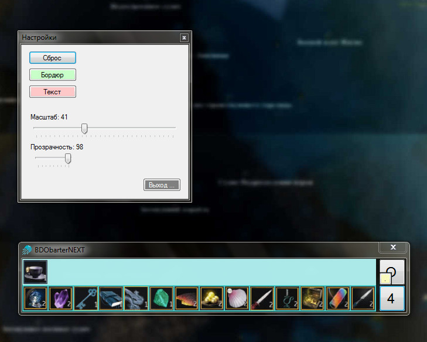
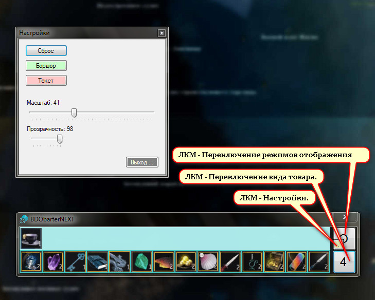

 
____ 
# BDObarterNote Release 1.0
    
Утилита в виде графического блокнота для прокладки маршрутов бартера в игре BDO.

Тема на кибер-форуме:
[www.cyberforum.ru](https://www.cyberforum.ru/mmo-games/thread1975425.html)
____ 
## Общий комментарий:
Прожект VS 2010 C# (+ portable версия exe в папке `bin`)

Базовый фреймворк: NET Framework 4 Client Profile.

Возможно понадобится дополнительная установка: [dotNetFx40_Client_x86_x64.exe](https://www.microsoft.com/ru-RU/download/details.aspx?id=24872). 

____ 
## Как оно выглядит:

:one: ...

:two: ...
 

 
:three: ...
 

____ 
...

