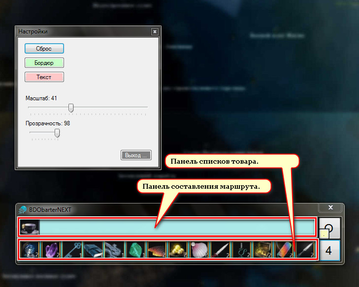

____ 
# Утилита в виде графического блокнота для прокладки маршрутов бартера в игре BDO.

Тема на кибер-форуме:
[www.cyberforum.ru](https://www.cyberforum.ru/mmo-games/thread1975425.html)
____ 
## Общий комментарий:

Прожект VS 2010 C#.

Базовый фреймворк: NET Framework 4 Client Profile.

Возможно понадобится дополнительная установка: [dotNetFx40_Client_x86_x64.exe](https://www.microsoft.com/ru-RU/download/details.aspx?id=24872). 

____ 

:one: 
____ 

:two: 
____ 

:three: 
____ 

____ 
...
